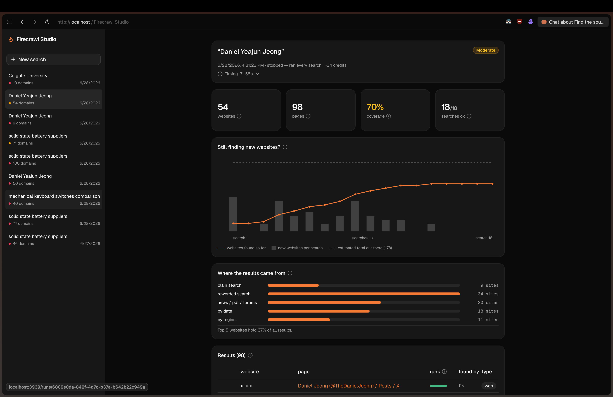

# Firecrawl Search Studio

*Better search coverage, then better ranking of that coverage, delivered as a CLI for batch jobs and a dashboard for exploration.*

## The situation

A competitive-intelligence customer (enterprise, $180k/yr, renewing this quarter) builds landscape reports that go straight to *their* clients, so for them completeness is the product. They already run Firecrawl search at limit 50, and their analysts *still* hand-find sources it never surfaced: trade publications, regional press, and niche forums. As their head of research put it, going from 10 to 50 results "just gave us forty more of the same SEO winners." A second customer, an AI research startup, has a related frustration. One ranking cannot serve every question (news wants freshness, research wants credible domains), so they pull 30 results and re-rank everything themselves.

Both pains share one root cause. **A single search returns a single ranking.** Raising the limit reads that one ranking *deeper*. It never reads *wider*, and no single ordering is right for every query.

## Which problems I chose

With about 20 hours and a brief that rewards depth over breadth, I picked along three lines. Serve the **highest-stakes** customer first (the enterprise renewal). Build only what **does not already exist** (for example, "give me 3 fast snippet results" is already `limit:3` with no scraping, a docs answer rather than a build). And keep it **general**, since one-off customizations bottleneck a scaling company. That points squarely at completeness (#1) and controllable ranking (#5), and they turn out to be one feature: **widen the net, then rank what you caught.** (Full analysis of all 11 requests at the end.)

## How I solved it



The whole idea in one sentence: instead of asking one ranking for *more*, ask the topic many *different* ways and combine the answers.

**1. Coverage through query expansion and setting variation.** One query becomes roughly twenty searches, a "fan-out." Some keep the words but change the lens: the news vertical, research/PDF categories, time windows, and a region sweep (a different `location` per call, since results are localized). Others change the words themselves, reformulations like *"…criticism"* or operator queries like *"…forum"* (this is *query expansion*, rewording to reach different results). Each search surfaces a different slice of the index. For example, searching *off-grid solar batteries* and listing a couple of niche sites pulls in a DIY-solar forum and a regional power forum that the plain search buries on page five. Latency is irrelevant here (these run overnight), so casting many nets is free in the only currency that matters.

**2. Reranking across *all* those lists, not Firecrawl's single one.** Merging the searches destroys each list's order, so I rebuild one global ranking. **Reciprocal Rank Fusion** (RRF, a standard way to merge ranked lists using only positions, no scores) fuses the roughly twenty search lists *plus* a **BM25** list (BM25, classic keyword-relevance scoring) computed against the *original* query, which pulls reformulations that drifted off-topic back toward what the user actually asked. Then **Maximal Marginal Relevance** (MMR, which repeatedly picks the next-best result while down-weighting ones too similar to what is already chosen) spreads the output across distinct sources instead of ten near-duplicates of the same page. Because customer #5 wanted control, two optional weights ride on top, *freshness* (recency) and *authority* (domain popularity, from the public **Tranco** ranking), both off by default. This is the heart of the project. The rerank operates on the *combined* result of many queries, not one.

**3. Telling the user how complete the search actually was.** Coverage you cannot trust is useless, so the headline output is not the result list. It is an honest coverage report. Two signals drive it: a *saturation curve* (are new sites still appearing with each search, or have we leveled off?) and a *capture-recapture* estimate (**Lincoln-Petersen**, which treats the original-query searches and the expanded searches as two independent "nets," where the fewer sites the two nets share, the more we are still missing). The dashboard renders these as a green / amber / red coverage figure and a blunt *thin / moderate / saturated* verdict, so a thin run is flagged loudly rather than quietly handing back a short list. A small credit note: Firecrawl bills per 10 results *per call*, so I pack categories and verticals into single multi-option calls for the same coverage at fewer credits.

## Two surfaces, one for each kind of client

The enterprise customer runs thousands of queries a night as batch jobs, so for them the **CLI** *is* the product: scriptable, writes a JSON artifact per run, drops into a pipeline. But ranking and completeness are judgment calls a human reads better from a picture than from JSON, so **Firecrawl Studio**, the dashboard, makes a run explorable: the saturation curve, where the long tail came from, the color-coded ranks. Think of Firecrawl's playground, but optimized for *analyzing* a search rather than firing one call. The CLI does the work, and Studio makes it legible (Prisma and Prisma Studio).

## What I corrected about the AI

Building with AI, the instructive failures were all in the ranking math.

- **It treated BM25 as a special score to blend** (literally proposing "0.65 RRF + 0.35 BM25"). But BM25 *is* a ranked list, and score-blending incomparable scales is the exact thing RRF avoids. I had it fold BM25 in as one more list inside a single RRF, and pick the weight by evaluation rather than feel.
- **It broke the MMR formula** subtly enough that every post-MMR score came out as 1.0. A unit test caught it, and I restored the standard objective.
- **It defaulted to intuition for numbers.** With no labeled relevance data to tune against, I built an eval harness using an LLM as a judge (scoring results 0 to 3) and chose weights by nDCG, and it *changed* a decision. A weak local judge said BM25 did not help, but a capable Claude judge showed it clearly did (weight 12 wins).
- **It pushed back on freshness and authority weights as "too hard."** Once reranking exists, those are just weights, and authority is a Tranco lookup. I overruled it.

```
# npm run eval:rank , nDCG@10 with a claude-opus-4-8 judge
rrf+bm25@12  0.802   (chosen default)      rrf_only   0.730
rrf+bm25@8   0.782                         bm25_only  0.692
rrf+bm25@1   0.741                         baseline   0.649  (Firecrawl's own order)
```

## The full decision (all 11 requests)

| # | Customer (tier, ARR, trend) | Ask | Decision and why |
|---|---|---|---|
| **1** | Competitive intel (**enterprise, $180k, flat, renewal Q3**) | Search completeness | **Built.** Highest leverage (renewal plus 3-team expansion) and a genuinely missing layer. This repo. |
| **5** | AI research startup (growth, $36k, ↑14%) | `intent` / rerank parameter | **Built.** Reranking with optional freshness and authority weights. |
| 2 | Price comparison (growth, $42k, ↓8%) | BYO proxies | **Support.** Classic noisy-neighbor. Move them to a dedicated or new IP. |
| 3 | OSS user (free) | `dedupe: true` markdown | **Depriortize** there are higher priorities|
| 4 | Indie dev (hobby, $348, ↑) | "3 results, snippets, fast" | **Exists.** `/search` `limit:3`, no `scrapeOptions`. Worth a docs example (~4,100 similar accounts). |
| 6 | Fortune 500 (prospect) | "Understand any website" | **Exists.** RAG over `/search` plus `/scrape` plus `/extract` or `/interact`. |
| 7 | Workflow automation (growth, $28k, ↑6%) | Which step failed | **Would build with more time.** A Vercel-deploy-status-style pipeline view that also addresses the 214 debugging tickets. |
| 8 | Startup (growth, $31k, flat) | Tail latency | Real, but low stakes (tier + a temporary workaround). Investigate if it propagates. |
| 9 | Data infra (growth, $38k, flat) | Self-maintaining extractors | Interesting and common, but tier plus scope. Deprioritize. |
| 10 | Sales intel (**scale, $60k, ↑18%**) | LinkedIn at scale | **Reroute.** Anti-bot arms race. Headcount and jobs are better via ATS plus SEC filings ([doc](https://www.firecrawl.dev/blog/scrape-job-boards-firecrawl-openai)). |
| 11 | AI agent startup (trial) | Authenticated multi-step sessions | Worth a reply, likely solvable with current offerings, probably not a build problem. |

**Deliberately not built:** scrape plus per-result rerank (useful but out of scope), a database (BM25 runs in-process, though a BM25-capable DB would help at larger scale), and any anti-bot work.

## Setup and usage

```bash
cp .env.example .env        # add FIRECRAWL_API_KEY, the only required input
npm install

npm run widen help
npm run widen search "solid state battery suppliers"   # CLI, the primary surface
npm run widen batch examples/queries.txt --budget 24   # overnight-job shape
npm run studio                                          # Firecrawl Studio at localhost:3939
```

## Limitations

- The eval *judge* needs a Claude key (`claude-opus-4-8`). The search itself needs only the Firecrawl key.
- `--llm` query expansion defaults to a local Ollama model. Deterministic expansion runs without it.
- Freshness only applies where Firecrawl returns a date (news), and authority covers the Tranco top 50k.
